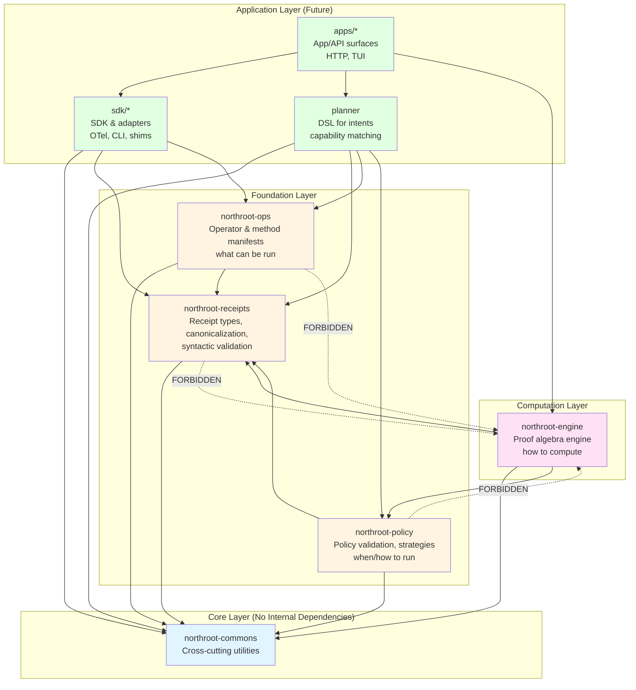
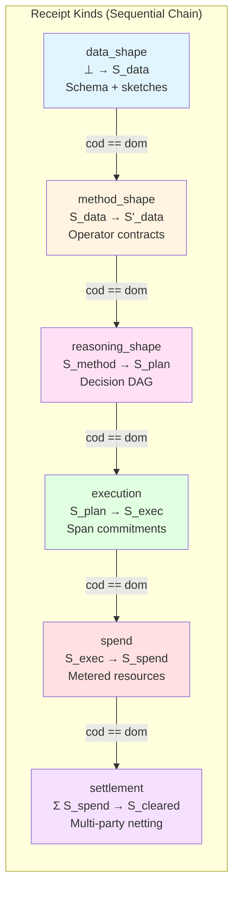
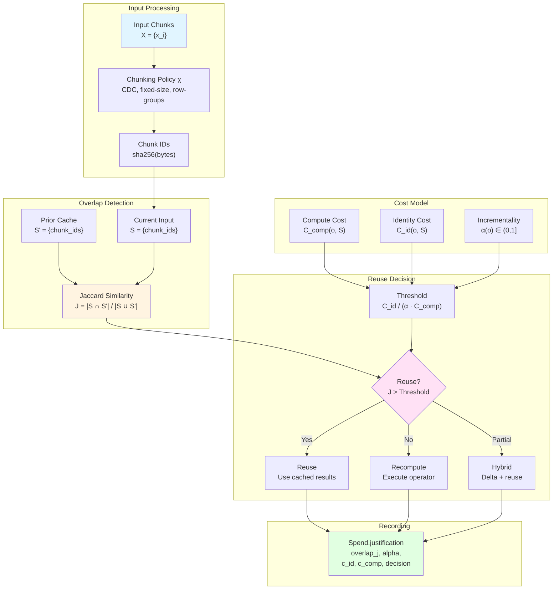
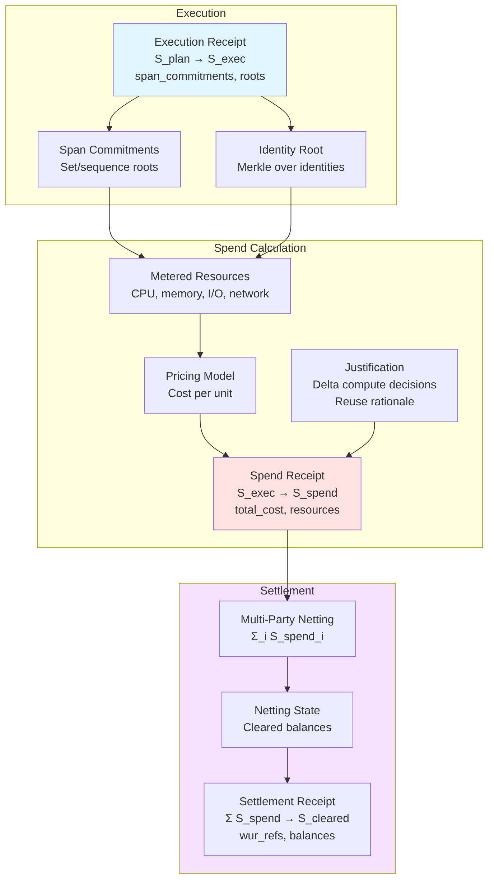
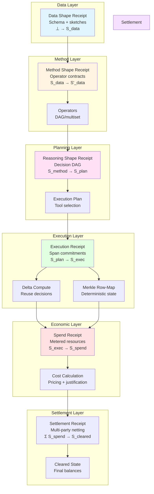
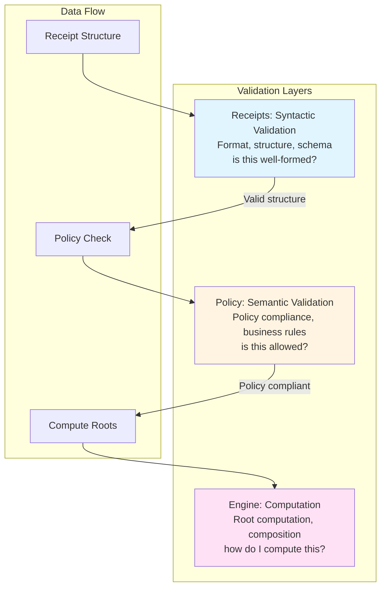

# Architecture Diagrams

This document contains Mermaid diagrams illustrating the Northroot repository structure, data flows, and key use cases.

**📊 Interactive View**: For better visualization, open [architecture-diagrams.html](architecture-diagrams.html) in your browser to see all diagrams rendered with Mermaid.js.

## Table of Contents

1. [Repository Structure & Dependencies](#repository-structure--dependencies)
2. [Receipt Composition Flow](#receipt-composition-flow)
3. [Delta Compute Flow](#delta-compute-flow)
4. [Verified Spend Flow](#verified-spend-flow)
5. [Unified Proof Flow](#unified-proof-flow)

---

## Repository Structure & Dependencies

This diagram shows the crate dependency graph and architectural boundaries.



**Key Boundaries:**
- **Commons**: No internal dependencies (foundation)
- **Receipts/Ops/Policy**: Depend only on commons (and receipts for ops/policy)
- **Engine**: Depends on receipts, policy (NOT the reverse)
- **Apps/SDK/Planner**: Outer layers, depend on inner layers

---

## Receipt Composition Flow

This diagram shows how receipts flow through the six kinds in a typical sequential chain.



**Composition Rules:**
- Sequential: `cod(R_i) == dom(R_{i+1})` for all adjacent receipts
- Parallel: Tensor product `R₁ ⊗ R₂` for independent branches
- All receipts share the same envelope structure
- Each kind has a specific payload schema

---

## Delta Compute Flow

This diagram illustrates the delta compute reuse decision process.



**Key Formula:**
```
Reuse iff: J(S, S') > C_id(o, S) / (α(o) · C_comp(o, S))
```

**Economic Delta:**
```
ΔC ≈ α(o) · C_comp(o, S) · J - C_id(o, S)
```

---

## Verified Spend Flow

This diagram shows the flow from execution through spend to settlement.



**Key Points:**
- Execution receipts record span commitments and identity roots
- Spend receipts capture metered resources and pricing
- Settlement receipts perform multi-party netting
- All linked via `dom`/`cod` commitments

---

## Unified Proof Flow

This diagram shows the complete end-to-end flow from data shape to settlement.



**Composition Rules:**
- Each receipt is a typed morphism: `f : (S, k) → (S', k')`
- Sequential composition: `cod(R_i) == dom(R_{i+1})`
- Parallel composition: Tensor product for independent branches
- All receipts share unified envelope structure
- Canonicalization ensures deterministic hashing

**Verification:**
- Hash integrity: `hash == sha256(canonical(body_without_sig_hash))`
- Signature verification: Detached signature over hash
- Composition validation: All `dom`/`cod` links must match
- Policy validation: Determinism class, tool/region constraints

---

## Boundary Enforcement

The following diagram shows how architectural boundaries are enforced.



**Key Boundaries:**
- **Receipts** (syntactic): Format checks, schema validation, structure integrity
- **Policy** (semantic): Policy compliance, determinism enforcement, constraints
- **Engine** (computation): Root computation, composition, execution tracking

**Dependency Rules:**
- Receipts → Commons only
- Policy → Commons, Receipts (NOT Engine)
- Engine → Commons, Receipts, Policy

---

## Related Documentation

- [Proof Algebra](proof_algebra.md) - Unified receipt algebra specification
- [Delta Compute](delta_compute.md) - Reuse decision formal spec
- [Merkle Row-Map](merkle_row_map.md) - Deterministic state representation
- [ADR Playbook](../ADR_PLAYBOOK.md) - Repository structure guide

